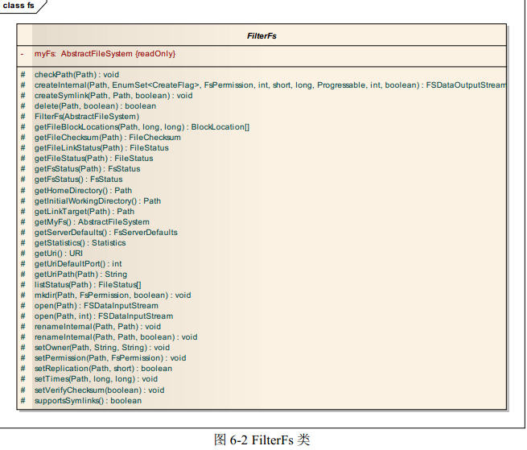
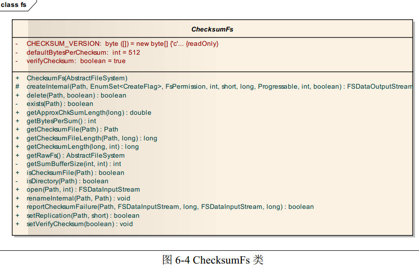

目录
=======

[1 修订记录](#1-修订记录)

[2 摘要](#2-摘要)

[3 org.apache.hadoop.fs包总述](#3-orgapachehadoopfs包总述)

[4 Hadoop文件系统概述](#4-hadoop文件系统概述)

[5 FileSystem深入分析](#5-filesystem深入分析)

[7 AbstractFileSystem分析](#7-abstractfilesystem分析)

1 修订记录
----------
序号 |        时间        | 修订人       | 版本
---- | ------------------ | ------------ | ----
1    | 2011 年 1 月 12 日 | 何芳、范永刚 | 1.0
2    | 2011 年 1 月 28 日 | 鲍亮         | 1.1
3    | 2014 年 5 月 18 日 | 213小组      | 1.2

*Hadoop版本: 2.4.0*

2 摘要
------
Hadoop是一个用于在通用硬件集群上进行大数据存储和处理的开源软件框架．

它主要包括以下几个模块：
* Hadoop Common. 包含其它模块需要的库和一些实用程序
* Hadoop Distributed File System (HDFS). 一个把数据存储在通用硬件的分布
式文件系统．在集群内能提供非常高的总计带宽
* Hadoop YARN. 用于管理集群内的计算资源和调度用户应用程序的资源管理平台
* Hadoop MapReduce. 一个用于大数据处理的编程模型．

所有的模块都在设计层面上考虑到了硬件错误．因此这些错误自动的在软件框架内被处理．

3 org.apache.hadoop.fs包总述
-----------------------------
org.apache.hadoop.fs包提供了一个抽象文件系统的 API．该包下有80多个类和接口，有7个包．
如图3-1所示
![img][3-1.jpg]

其中有8个接口, 有四个抽象类: FileSystem, AbstractFileSystem, ChecksumFileSystem, TrashPolicy．

FileSystem 抽象类和 AbstractFileSystem 抽象类作为抽象文件系统
的基类,提供了基本的抽象操作。其中 FileSystem 类是 0.21 版本之前唯一的基类,但在 0.21 版本
中,出现了 AbstractFileSystem,该类似乎来取代 FileSystem 类原来的部分功能。在这两个基类的
基础上形成了两个类继承的层次结构。

org.apache.hadoop.fs 子包 ftp、 local、 s3、 s3native 和 Hdfs 类都是实现的对具体的文件系统操作的类.
permission文件夹实现了有关文件访问许可的功能。shell 文件夹实现了对 shell 命令的调用。

4 Hadoop文件系统概述
-------------------
* [4.1 类层次结构](#41-类层次结构)
* [4.2 输入输出流](#42-输入输出流)
    * [4.2.1 Java中的IO](#421-java中的io)
    * [4.2.2 Hadoop中的IO](#422-hadoop中的io)

###4.1 类层次结构
Hadoop 文件系统可以访问多个不同的具体的文件系统,如 HDFS、LocalFS和 S3 文件系统。不
同的文件系统具有不同的具体实现,Hadoop fs包下实现的是一层类似 Linux 中的 VFS 虚拟文件系统,它从不同
的文件系统中抽取了共同的操作,这些操作是一般的文件系统都具有的操作,如打开文件,创建
文件,删除文件,复制文件,获取文件的信息等。这些共同的基本操作组合在一起就形成了
FileSystem 抽象类和 AbstractFileSystem 抽象类。然后从基类派生,以实现对不同文件系统的统一操作。

*注解:*
HDFS是Hadoop下的另一子模块，它是一个分布式文件系统，是具体的文件系统实现．它和S3, LocalFS都是文件系统.
而org.apache.hadoop.fs包是对不同文件系统的抽象表示，它建立了一个抽象的统一的文件系统接口.
应用程序开发者通过fs包可以和不同的文件系统交互，而不用知道它所进行的操作所在的具体是什么文件系统．
而不同的文件系统开发者则可以根据fs包很容易的使其它文件系统支持Hadoop.

fs包下的类继承层次结构如图 4-1 所示:
![img][4-1.png]
fs各子包下的类继承层次结构如图4-2所示:
![img][4-2.png]

除 FilterFileSystem 外,FileSystem 的直接子类都是跟具体文件系统交互的类。包括以下子类:
* 由FileSystem派生:
    * S3FileSystem(org.apache.hadoop.fs.s3) - 数据以块形式存储在[Amazon S3][S3]
    * NativeS3FileSystem(org.apache.hadoop.fs.s3) - 文件以原生格式存储在[Amazon S3][S3]
    * ChRootedFileSystem(org.apache.hadoop.fs.viewfs) - 根目录为已有文件系统的某个路径的文件系统
    * ViewFileSystem(org.apache.hadoop.fs.viewfs) - 实现了客户端的挂载表
    * DistributedFileSystem(org.apache.hadoop.hdfs) - 为DFS system 实现了抽象类FileSystem. 用户代码通过该类和Hadoop DistributedFileSystem交互
    * LocalFileSystem - 为还有校验功能的本地文件系统实现了FileSystem API(内部使用RawLocalFileSystem, Decorator Pattern)
    * RawLocalFileSystem - 为原生本地文件系统实现了FileSystem API
    * FTPFileSystem(org.apache.hadoop.fs.ftp) - 基于FTP协议和FTP服务器交互的FileSystem API实现
* 由AbstractFileSystem派生:
    * RawLocalFs(org.apache.hadoop.fs.local) - 内部委派给RawLocalFileSystem来实现AbstractFileSystem API(delegation pattern)
    * FtpFs(org.apache.hadoop.fs.ftp) - 内部委派给FTPFileSystem来实现AbstractFileSystem API(delegation pattern)
    * LocalFs(org.apache.hadoop.fs.local) - 和LocalFileSystem的实现类似, 继承ChecksumFs. (内部使用RawLocalFs实现, Decorator Pattern)
    * ViewFs(org.apache.hadoop.fs.viewfs) - 完全在客户端的内存中实现挂载表
    * Hdfs - 为Hadoop DistributedFileSystem实现了AbstractFileSystem API

*注解:*
* LocalFileSystem是加上Checksum功能的本地文件系统，该类和操作系统本地文件系统交互，内部使用RawLocalFileSystem.
RawLocalFileSystem是代表没有Checksum功能的操作系统本地文件系统．
* 继承自AbstractFileSystem的LocalFS和RawLocalFs结构同上．其内部实现被委派给RawLocalFileSystem.
* Amazon S3没有5G限制


Hadoop 的使用者可以分为两类,应用程序编写者和文件系统实现者。在 Hadoop 0.21 版本之
前, FileSystem 类作为一般(抽象)文件系统的基类,一方面为应用程序编写者提供了使用 Hadoop
文件系统的接口,另一方面,为文件系统实现者提供了实现一个文件系统的接口(如 hdfs,本地
文件系统,FtpFs等等)。

但在 Hadoop 0.21 版本中,出现了 FileContext 类和 AbstractFileSystem 类,
通过这两个 API,可以将原来集中于 FileSystem 一个类中的功能分开,让使用者更加方便的在应
用程序中使用多个文件系统。

FileContext 这个 API 还没有在 hadoop 中被大量的使用,因为还没有
被合并到 mapreduce 计算中,但是它包含了正常的 FileSystem 接口没有的新功能,如支持 hdfs
层面的软链接等。

FileContext 类是用来取代 FileSystem 类,向 应用程序编写者 提供使用 Hadoop
文件系统的接口,而原来的 FileSystem 则仅由 文件系统实现者 使用。估计 AbstractFileSystem 类将
来会取代 FileSystem 类。

从图 4-1, 4-2 中可以看出 AbstractFileSystem 对应 FileSystem,FilterFs 对应 FiterFileSystem,
ChecksumFs 对应 ChecksumFileSystem,LocalFs 对应 LocalFileSystem, RawLocalFs 对应 RawLocalFileSystem。

而在各个具体的文件系统类, FtpFs 和RawLocalFs
通过DelegateToFileSystem(delegation pattern)委派给已有的FTPFileSystem, RawLocalFileSystem,
ViewFs, hdfs的实现是根据各个文件系统的特点直接实现的

###4.2 输入输出流
Hadoop 中类的设计在很多地方模仿了 Java。典型的就是文件的输入输出流。
如图4-3:
![img][4-3.png]
如图4-4
![img][4-4.png]

####4.2.1 Java中的IO
可将 Java 库的 IO 类分割为输入与输出两个部分,这一点在用 Web 浏览器阅读联机 Java 类
文档时便可知道。通过继承,从 InputStream(输入流)衍生的所有类都拥有名为 read()的基本方
法,用于读取单个字节或者字节数组。类似地,从 OutputStream 衍生的所有类都拥有基本方法
write(),用于写入单个字节或者字节数组。然而,我们通常不会用到这些方法;它们之所以存在,
是因为更复杂的类可以利用它们,以便提供一个更有用的接口。因此,我们很少用单个类创建自
己的系统对象。一般情况下,我们都是将多个对象重叠在一起,提供自己期望的功能。我们之所
以感到 Java 的流库(Stream Library)异常复杂,正是由于为了创建单独一个结果流,却需要创建
多个对象的缘故。很有必要按照功能对类进行分类。库的设计者首先决定与输入有关的所有类都
从 InputStream 继承,而与输出有关的所有类都从 OutputStream 继承。

#####4.2.1.1 InputStream
InputStream 的作用是标志那些从不同起源地产生输入的类。这些起源地包括(每个都有一个
相关的 InputStream 子类):

1. 字节数组
2. String 对象
3. 文件
4. “管道”,它的工作原理与现实生活中的管道类似:将一些东西置入一端,它们在另一端
    出来
5. 一系列其他流,以便我们将其统一收集到单独一个流内
6. 其他起源地,如 Internet 连接等

除此以外,FilterInputStream 也属于 InputStream 的一种类型,用它可为“装饰器”类提供一
个基础类(装饰器模式), 以便将属性或者有用的接口同输入流连接到一起

ByteArrayInputStream:允许内存中的一个缓冲区作为 InputStream,使用从中提取字节的缓冲
区作为一个数据源使用。通过将其同一个 FilterInputStream 对象连接,可提供一个有用的接口。

StringBufferInputStream:将一个 String 转换成 InputStream 一个 String(字串)。基础的实施
方案实际采用一个 StringBuffer (字串缓冲)作为一个数据源使用。通过将其同一个 FilterInputStream
对象连接,可提供一个有用的接口。

FileInputStream:用于从文件读取信息代表文件名的一个 String,或者一个 File FileDescriptor
对象作为一个数据源使用。通过将其同一个 FilterInputStream 对象连接,可提供一个有用的接口。

PipedInputStream:读出与之相关的PipedOutputStream 写的数据。实现了“管道化”的概念。

SequenceInputStream:将两个或更多的 InputStream 对象转换成单个 InputStream. 参数为两个
InputStream 对象或者一个 包含InputStream的Enumeration容器.
作为一个数据源使用, 通过将其同一个 FilterInputStream 对象连接,可提供一个有用的接口.

FilterInputStream:作为具体装饰器类的抽象类; 装饰器类为其他 InputStream 类提供了有用的功能。

#####4.2.1.2 OutputStream
这一类别包括的类决定了我们的输入往何处去:一个字节数组(但没有 String;假定我们可用
字节数组创建一个);一个文件;或者一个“管道”。

除此以外,FilterOutputStream 为装饰器类提供了一个基础类,它将属性或者有用的接口
同输出流连接起来

ByteArrayOutputStream:在内存中创建一个缓冲区。我们发送给流的所有数据都会置入这个
缓冲区。可选缓冲区的初始大小用于指出数据的目的地。若将其同 FilterOutputStream 对象连接到
一起,可提供一个有用的接口。

FileOutputStream:将信息发给一个文件,用一个 String 代表文件名,或选用一个 File 或
FileDescriptor 对象用于指出数据的目的地。若将其同 FilterOutputStream 对象连接到一起,可提供
一个有用的接口。

PipedOutputStream:我们写给它的任何信息都会自动会从相关的 PipedInputStream 读出。实
现 了 “ 管 道 化 ” 的 概 念 。 PipedInputStream为多线程处理指出自己数据的目的地, 将其同
FilterOutputStream 对象连接到一起,便可提供一个有用的接口

FilterOutputStream 对作为装饰器接口使用的类进行抽象处理;那个装饰器为其它OutputStream
类提供了有用的功能

#####4.2.1.3 DataInputStream
DataInputStream 从 FilterInputStream 派生, 需要传入一个InputStream.
数据输入流允许应用程序以与机器无关方式从底层输入流中读取基本 Java 数据类型。应用程
序可以使用数据输出流写入稍后由数据输入流读取的数据。DataInputStream 对于多线程访问不一
定是安全的。线程安全是可选的,它由此类方法的使用者负责。

#####4.2.1.4 DataOutputStream
DataOutputStream 数据输出流允许应用程序以适当方式将基本 Java 数据类型写入输出流中。
然后,应用程序可以使用数据输入流将数据读入。

####4.2.2 Hadoop中的IO
在 Hadoop 中, FSInputStream(Abstract Class)、
FSDataInputStream 和 FSDataOutputStream 的作用与 InputStream、
DataInputStream 和 DataOutputStream 在 Java IO 中的作用类似。用 FileSystem 的 create 方法创建
一个输出流时的返回值类型为 FSDataOutputStream,而 open 方法则返回一个 FSDataInputStream 实例。

Hadoop 中并没有 FSOutputStream,有些FileSystem类从 OutputStream 派生实现了自己的OutputStream.
很多文件系统都会从 FSInputStream 派生出和自己特定文件系统相关的FSInputStream.
通过这种方式实现自己特定的输入输出流. 如 S3InputStream RawLocalFileSystem 等等。

5 FileSystem深入分析
--------------------
* [5.1 fs中的接口](#51-fs中的接口)
* [5.2 FileSystem](#52-FileSystem)
    * [5.2.1 Configured基类和Closeable接口](#521-configured基类和closeable接口)
    * [5.2.2 FileSystem的内部类和属性](#522-filesystem的内部类和属性)
    * [5.2.3 文件系统的获取](#523-文件系统的获取)
    * [5.2.4 文件系统的关闭](#524-文件系统的关闭)
    * [5.2.5 读取数据](#525-读取数据)
    * [5.2.6 写入数据](#526-写入数据)
    * [5.2.7 文件操作](#527-文件操作)
    * [5.2.8 查询文件系统](#528-查询文件系统)
    * [5.2.9 其它方法](#529-其它方法)
* [5.3 FilterFileSystem](#53-filterfilesystem)
* [5.4 ChecksumFileSystem](#54-checksumfilesystem)
* [5.5 LocalFileSystem](#55-localfilesystem)

###5.1 fs中的接口
org.apache.hadoop.fs包中的接口不多，有：

* CanSetDropBehind - 配置流是否应该丢掉缓存
* CanSetReadahead - 设置预读取流
* FsConstants     表示文件系统有关的常量。
* PathFilter - 测试抽象路径名是否应该包含在某个抽象路径名表中
* PositionedReadable 和Seekable 提供了随机读写功能
* Syncable        文件同步
* VolumeId - 标识一个硬盘位置的接口

###5.2 FileSystem
FileSystem 的类图如图5-1:
![img][5-1.jpg]

由此可见FileSystem 是一个很大的抽象类。在fs 包中，最重要的可以说是FileSystem 抽象类。
它定义了文件系统中涉及的一些基本操作，如：create，rename ，delete...
另外包括一些分布式文件系统具有的操作：copyFromLocalFile, copyToLocalFile,...
类似于Ftp 中put 和get 操作。
LocalFileSystem 和DistributedFileSystem，继承于此类，
分别实现了对本地文件系统和分布式文件系统的FileSystem API。


####5.2.1 Configured基类和Closeable接口
FileSystem 抽象类从Configured 基类派生，并实现了Closeable 接口。
Configured 基类的源代码如下，该基类仅是简单的提供了访问配置文件的方法。

```java
public class Configured implements Configurable {

  private Configuration conf;

  /** Construct a Configured. */
  public Configured() {
    this(null);
  }

  /** Construct a Configured. */
  public Configured(Configuration conf) {
    setConf(conf);
  }

  // inherit javadoc
  @Override
  public void setConf(Configuration conf) {
    this.conf = conf;
  }

  // inherit javadoc
  @Override
  public Configuration getConf() {
    return conf;
  }

}
```
Closeable接口的代码如下, 该接口主要是声明关闭流的close方法, 调用close方法释放与该流相关的所有系统资源

```java
public interface Closeable extends AutoCloseable {

    /**
     * Closes this stream and releases any system resources associated
     * with it. If the stream is already closed then invoking this
     * method has no effect.
     *
     * @throws IOException if an I/O error occurs
     */
    public void close() throws IOException;
}
```

####5.2.2 FileSystem的内部类和属性
内部类有Cache, Statistics.

FileSystem内部的属性见下面代码:
```java
public static final String FS_DEFAULT_NAME_KEY =
                 CommonConfigurationKeys.FS_DEFAULT_NAME_KEY;
public static final String DEFAULT_FS =
                 CommonConfigurationKeys.FS_DEFAULT_NAME_DEFAULT;

public static final Log LOG = LogFactory.getLog(FileSystem.class);

/**
 * Priority of the FileSystem shutdown hook.
 */
public static final int SHUTDOWN_HOOK_PRIORITY = 10;

/** FileSystem cache */
static final Cache CACHE = new Cache();

/** The key this instance is stored under in the cache. */
private Cache.Key key;

/** Recording statistics per a FileSystem class */
private static final Map<Class<? extends FileSystem>, Statistics> 
  statisticsTable =
    new IdentityHashMap<Class<? extends FileSystem>, Statistics>();
 
/**
 * The statistics for this file system.
 */
protected Statistics statistics;

/**
 * A cache of files that should be deleted when filsystem is closed
 * or the JVM is exited.
 */
private Set<Path> deleteOnExit = new TreeSet<Path>();
 
boolean resolveSymlinks;
```

#####5.2.2.1 Cache
FileSystem 内部类 Cache 用来缓存文件系统对象。

Cache成员, 方法见下图:

![img][5-2.png]

在检索文件系统时,如果缓存未被禁用,则会首先从缓存中读取。

Cache 中有两个内部类,ClientFinalizer 和 Key。

ClientFinalizer类:

![img][5-3.png]

ClientFinalizer类为一线程类,当Java虚拟机停止运行时,该线程才会运行。而运行时,run
方法会调用 Cache.closeAll(true)方法,进行清理工作。

内部静态类Key,顾名思意,它作为Cache中HashMap<Key, FileSystem>的关键字。保存了
有关文件系统的 Uri 的信息,而其中的各个方法也是简单明了。

![img][5-4.png]

Cache类中的集合toAutoClose属性用来表示是否需要自动关闭Key所对应的文件系统。
Cache方法get()和getUnique()内部仅简单地调用了getInternal()方法。
其代码所下：

```java
private FileSystem getInternal(URI uri, Configuration conf, Key key) throws IOException{
  FileSystem fs;
  synchronized (this) {
    fs = map.get(key);
  }
  if (fs != null) {
    return fs;
  }

  fs = createFileSystem(uri, conf);
  synchronized (this) { // refetch the lock again
    FileSystem oldfs = map.get(key);
    if (oldfs != null) { // a file system is created while lock is releasing
      fs.close(); // close the new file system
      return oldfs;  // return the old file system
    }

    // now insert the new file system into the map
    if (map.isEmpty()
            && !ShutdownHookManager.get().isShutdownInProgress()) {
      ShutdownHookManager.get().addShutdownHook(clientFinalizer, SHUTDOWN_HOOK_PRIORITY);
    }
    fs.key = key;
    map.put(key, fs);
    if (conf.getBoolean("fs.automatic.close", true)) {
          toAutoClose.add(key);
        }
        return fs;
  }
}
```

在getInternal中调用FileSystem.createFileSystem打开一个文件系统

```java
private static FileSystem createFileSystem(URI uri, Configuration conf
     ) throws IOException {
   Class<?> clazz = getFileSystemClass(uri.getScheme(), conf);
   if (clazz == null) {
     throw new IOException("No FileSystem for scheme: " + uri.getScheme());
   }
   FileSystem fs = (FileSystem)ReflectionUtils.newInstance(clazz, conf);
   fs.initialize(uri, conf);
   return fs;
}
```
ReflectionUtils.newInstance()则利用 Java 的反射机制,调用 clazz 的构造函数,设置配置文件

后,将生成的对象返回。

Cache方法 synchronized void remove(Key key, FileSystem fs)用来从映射 map 中删除相应的 key 和 fs
对应的映射。

Cache方法 synchronized void closeAll(boolean onlyAutomatic) throws IOException 用来删除所有的映
射,并调用文件系统的 close()方法。当 onlyAutomatic 为 true 时,仅删除在集合 toAutoClose 中含
有的键值对。

####5.2.3 文件系统的获取
FileSystem 是一个普通的文件系统API，所以首要任务是检索我们要用的文件系统实例。
取得FileSystem 实例有三种静态工厂方法get() 。
这些 get() 方法是Hadoop 0.21版本之前就存在的，但在0.21 版本中又添加了与之功能相同的三个方法newInstance() 。

get() 方法如下：

```java
  /**
   * Get a filesystem instance based on the uri, the passed
   * configuration and the user
   * @param uri of the filesystem
   * @param conf the configuration to use
   * @param user to perform the get as
   * @return the filesystem instance
   * @throws IOException
   * @throws InterruptedException
   */
  public static FileSystem get(final URI uri, final Configuration conf,
        final String user) throws IOException, InterruptedException {
    String ticketCachePath =
      conf.get(CommonConfigurationKeys.KERBEROS_TICKET_CACHE_PATH);
    UserGroupInformation ugi =
        UserGroupInformation.getBestUGI(ticketCachePath, user);
    return ugi.doAs(new PrivilegedExceptionAction<FileSystem>() {
      @Override
      public FileSystem run() throws IOException {
        return get(uri, conf);
      }
    });
  }

  /**
   * Returns the configured filesystem implementation.
   * @param conf the configuration to use
   */
  public static FileSystem get(Configuration conf) throws IOException {
    return get(getDefaultUri(conf), conf);
  }

  public static FileSystem get(URI uri, Configuration conf) throws IOException {
    String scheme = uri.getScheme();
    String authority = uri.getAuthority();

    if (scheme == null && authority == null) {     // use default FS
      return get(conf);
    }

    if (scheme != null && authority == null) {     // no authority
      URI defaultUri = getDefaultUri(conf);
      if (scheme.equals(defaultUri.getScheme())    // if scheme matches default
          && defaultUri.getAuthority() != null) {  // & default has authority
        return get(defaultUri, conf);              // return default
      }
    }

    String disableCacheName = String.format("fs.%s.impl.disable.cache", scheme);
    if (conf.getBoolean(disableCacheName, false)) {
      return createFileSystem(uri, conf);
    }

    return CACHE.get(uri, conf);
  }
```
各个newInstance() 方法分别对应一个get() 方法，完成的功能也是一样。

####5.2.4 文件系统的关闭
有两个方法来关闭文件系统。closeAll()用来关闭所有的文件系统。
而close() 只是关闭当前调用该方法的文件系统，代码如下:

```java
  /**
   * Close all cached filesystems. Be sure those filesystems are not
   * used anymore.
   *
   * @throws IOException
   */
  public static void closeAll() throws IOException {
    CACHE.closeAll();
  }

  /**
   * No more filesystem operations are needed.  Will
   * release any held locks.
   */
  @Override
  public void close() throws IOException {
    // delete all files that were marked as delete-on-exit.
    processDeleteOnExit();
    CACHE.remove(this.key, this);
  }
```
####5.2.5 读取数据
数据的读取就像Java 中的io 一样，首先要获得一个输入流。输入流是通过open()方法获得的。
抽象方法open()将由各个不同的文件系统重写，如下:

```java
  /**
   * Opens an FSDataInputStream at the indicated Path.
   * @param f the file name to open
   * @param bufferSize the size of the buffer to be used.
   */
  public abstract FSDataInputStream open(Path f, int bufferSize)
    throws IOException;

  public FSDataInputStream open(Path f) throws IOException {
    return open(f, getConf().getInt("io.file.buffer.size", 4096));
  }

```

RawLocalFileSystem 的open 实现：

```java
  @Override
  public FSDataInputStream open(Path f, int bufferSize) throws IOException {
    if (!exists(f)) {
      throw new FileNotFoundException(f.toString());
    }
    return new FSDataInputStream(new BufferedFSInputStream(
        new LocalFSFileInputStream(f), bufferSize));
  }
```

其他文件系统的实现类似。

####5.2.6 写入数据
向文件系统中写入数据，或新建一个文件，需要获得一个用来写的输出流，
这可以通过以下的多个create()方法来实现。
这些重载的方法允许我们指定是否强制覆盖已有的文件、
文件副本数量、写入文件时的缓冲大小、文件块大小以及文件许可等等。

```java
  public FSDataOutputStream create(Path f) throws IOException {
    return create(f, true);
  }

  /**
   * Create an FSDataOutputStream at the indicated Path.
   * @param f the file to create
   * @param overwrite if a file with this name already exists, then if true,
   *   the file will be overwritten, and if false an exception will be thrown.
   */
  public FSDataOutputStream create(Path f, boolean overwrite)
      throws IOException {
    return create(f, overwrite, 
                  getConf().getInt("io.file.buffer.size", 4096),
                  getDefaultReplication(f),
                  getDefaultBlockSize(f));
  }

  /**
   * Create an FSDataOutputStream at the indicated Path with write-progress
   * reporting.
   * Files are overwritten by default.
   * @param f the file to create
   * @param progress to report progress
   */
  public FSDataOutputStream create(Path f, Progressable progress) 
      throws IOException {
    return create(f, true, 
                  getConf().getInt("io.file.buffer.size", 4096),
                  getDefaultReplication(f),
                  getDefaultBlockSize(f), progress);
  }

  /**
   * Create an FSDataOutputStream at the indicated Path.
   * Files are overwritten by default.
   * @param f the file to create
   * @param replication the replication factor
   */
  public FSDataOutputStream create(Path f, short replication)
      throws IOException {
    return create(f, true, 
                  getConf().getInt("io.file.buffer.size", 4096),
                  replication,
                  getDefaultBlockSize(f));
  }

  /**
   * Create an FSDataOutputStream at the indicated Path with write-progress
   * reporting.
   * Files are overwritten by default.
   * @param f the file to create
   * @param replication the replication factor
   * @param progress to report progress
   */
  public FSDataOutputStream create(Path f, short replication, 
      Progressable progress) throws IOException {
    return create(f, true, 
                  getConf().getInt(
                      CommonConfigurationKeysPublic.IO_FILE_BUFFER_SIZE_KEY,
                      CommonConfigurationKeysPublic.IO_FILE_BUFFER_SIZE_DEFAULT),
                  replication,
                  getDefaultBlockSize(f), progress);
  }

    
  /**
   * Create an FSDataOutputStream at the indicated Path.
   * @param f the file name to create
   * @param overwrite if a file with this name already exists, then if true,
   *   the file will be overwritten, and if false an error will be thrown.
   * @param bufferSize the size of the buffer to be used.
   */
  public FSDataOutputStream create(Path f, 
                                   boolean overwrite,
                                   int bufferSize
                                   ) throws IOException {
    return create(f, overwrite, bufferSize, 
                  getDefaultReplication(f),
                  getDefaultBlockSize(f));
  }
    
  /**
   * Create an FSDataOutputStream at the indicated Path with write-progress
   * reporting.
   * @param f the path of the file to open
   * @param overwrite if a file with this name already exists, then if true,
   *   the file will be overwritten, and if false an error will be thrown.
   * @param bufferSize the size of the buffer to be used.
   */
  public FSDataOutputStream create(Path f, 
                                   boolean overwrite,
                                   int bufferSize,
                                   Progressable progress
                                   ) throws IOException {
    return create(f, overwrite, bufferSize, 
                  getDefaultReplication(f),
                  getDefaultBlockSize(f), progress);
  }
    
    
  /**
   * Create an FSDataOutputStream at the indicated Path.
   * @param f the file name to open
   * @param overwrite if a file with this name already exists, then if true,
   *   the file will be overwritten, and if false an error will be thrown.
   * @param bufferSize the size of the buffer to be used.
   * @param replication required block replication for the file. 
   */
  public FSDataOutputStream create(Path f, 
                                   boolean overwrite,
                                   int bufferSize,
                                   short replication,
                                   long blockSize
                                   ) throws IOException {
    return create(f, overwrite, bufferSize, replication, blockSize, null);
  }

  /**
   * Create an FSDataOutputStream at the indicated Path with write-progress
   * reporting.
   * @param f the file name to open
   * @param overwrite if a file with this name already exists, then if true,
   *   the file will be overwritten, and if false an error will be thrown.
   * @param bufferSize the size of the buffer to be used.
   * @param replication required block replication for the file. 
   */
  public FSDataOutputStream create(Path f,
                                            boolean overwrite,
                                            int bufferSize,
                                            short replication,
                                            long blockSize,
                                            Progressable progress
                                            ) throws IOException {
    return this.create(f, FsPermission.getFileDefault().applyUMask(
        FsPermission.getUMask(getConf())), overwrite, bufferSize,
        replication, blockSize, progress);
  }

  /**
   * Create an FSDataOutputStream at the indicated Path with write-progress
   * reporting.
   * @param f the file name to open
   * @param permission
   * @param flags {@link CreateFlag}s to use for this stream.
   * @param bufferSize the size of the buffer to be used.
   * @param replication required block replication for the file.
   * @param blockSize
   * @param progress
   * @throws IOException
   * @see #setPermission(Path, FsPermission)
   */
  public FSDataOutputStream create(Path f,
      FsPermission permission,
      EnumSet<CreateFlag> flags,
      int bufferSize,
      short replication,
      long blockSize,
      Progressable progress) throws IOException {
    return create(f, permission, flags, bufferSize, replication,
        blockSize, progress, null);
  }
  
  /**
   * Create an FSDataOutputStream at the indicated Path with a custom
   * checksum option
   * @param f the file name to open
   * @param permission
   * @param flags {@link CreateFlag}s to use for this stream.
   * @param bufferSize the size of the buffer to be used.
   * @param replication required block replication for the file.
   * @param blockSize
   * @param progress
   * @param checksumOpt checksum parameter. If null, the values
   *        found in conf will be used.
   * @throws IOException
   * @see #setPermission(Path, FsPermission)
   */
  public FSDataOutputStream create(Path f,
      FsPermission permission,
      EnumSet<CreateFlag> flags,
      int bufferSize,
      short replication,
      long blockSize,
      Progressable progress,
      ChecksumOpt checksumOpt) throws IOException {
    // Checksum options are ignored by default. The file systems that
    // implement checksum need to override this method. The full
    // support is currently only available in DFS.
    return create(f, permission, flags.contains(CreateFlag.OVERWRITE), 
        bufferSize, replication, blockSize, progress);
  }
```

由此可见，各个create 方法最终都是调用了抽象方法create。

```java
  /**
   * Create an FSDataOutputStream at the indicated Path with write-progress
   * reporting.
   * @param f the file name to open
   * @param permission
   * @param overwrite if a file with this name already exists, then if true,
   *   the file will be overwritten, and if false an error will be thrown.
   * @param bufferSize the size of the buffer to be used.
   * @param replication required block replication for the file.
   * @param blockSize
   * @param progress
   * @throws IOException
   * @see #setPermission(Path, FsPermission)
   */
  public abstract FSDataOutputStream create(Path f,
      FsPermission permission,
      boolean overwrite,
      int bufferSize,
      short replication,
      long blockSize,
      Progressable progress) throws IOException;
```

还有一个用于传递回调接口的重载方法Progressable，如此一来，我们所写的应用就会被告知
数据写入数据节点的进度，Progressable接口的代码片段如下：

```java
/**
 * A facility for reporting progress.
 * 
 * <p>Clients and/or applications can use the provided <code>Progressable</code>
 * to explicitly report progress to the Hadoop framework. This is especially
 * important for operations which take significant amount of time since,
 * in-lieu of the reported progress, the framework has to assume that an error
 * has occured and time-out the operation.</p>
 */
@InterfaceAudience.Public
@InterfaceStability.Stable
public interface Progressable {
  /**
   * Report progress to the Hadoop framework.
   */
  public void progress();
}
```

新建文件的另一种方法是使用append() 在一个已有文件中追加( 也有一些其他重载版本) 。
重要的是抽象方法append() 。同抽象方法create 一样，各个派生类需要重写. 代码如下:

```java
  /**
   * Append to an existing file (optional operation).
   * Same as append(f, getConf().getInt("io.file.buffer.size", 4096), null)
   * @param f the existing file to be appended.
   * @throws IOException
   */
  public FSDataOutputStream append(Path f) throws IOException {
    return append(f, getConf().getInt("io.file.buffer.size", 4096), null);
  }
  /**
   * Append to an existing file (optional operation).
   * Same as append(f, bufferSize, null).
   * @param f the existing file to be appended.
   * @param bufferSize the size of the buffer to be used.
   * @throws IOException
   */
  public FSDataOutputStream append(Path f, int bufferSize) throws IOException {
    return append(f, bufferSize, null);
  }

  /**
   * Append to an existing file (optional operation).
   * @param f the existing file to be appended.
   * @param bufferSize the size of the buffer to be used.
   * @param progress for reporting progress if it is not null.
   * @throws IOException
   */
  public abstract FSDataOutputStream append(Path f, int bufferSize,
      Progressable progress) throws IOException;

```

同open 一样，不同的文件系统的实现会重新改函数的实现。

####5.2.7 文件操作

#####5.2.7.1 重命名
文件重命名使用抽象方法rename() 实现，其代码如下所示。
0.21 版本以前使用非抽象方法rename() 方法实现。
但现在该方法已经不再推荐使用。

```java
  public abstract boolean rename(Path src, Path dst) throws IOException;

  /**
   * Renames Path src to Path dst
   * <ul>
   * <li
   * <li>Fails if src is a file and dst is a directory.
   * <li>Fails if src is a directory and dst is a file.
   * <li>Fails if the parent of dst does not exist or is a file.
   * </ul>
   * <p>
   * If OVERWRITE option is not passed as an argument, rename fails
   * if the dst already exists.
   * <p>
   * If OVERWRITE option is passed as an argument, rename overwrites
   * the dst if it is a file or an empty directory. Rename fails if dst is
   * a non-empty directory.
   * <p>
   * Note that atomicity of rename is dependent on the file system
   * implementation. Please refer to the file system documentation for
   * details. This default implementation is non atomic.
   * <p>
   * This method is deprecated since it is a temporary method added to 
   * support the transition from FileSystem to FileContext for user 
   * applications.
   * 
   * @param src path to be renamed
   * @param dst new path after rename
   * @throws IOException on failure
   */
  @Deprecated
  protected void rename(final Path src, final Path dst,
      final Rename... options) throws IOException {
    // Default implementation
    final FileStatus srcStatus = getFileLinkStatus(src);
    if (srcStatus == null) {
      throw new FileNotFoundException("rename source " + src + " not found.");
    }

    boolean overwrite = false;
    if (null != options) {
      for (Rename option : options) {
        if (option == Rename.OVERWRITE) {
          overwrite = true;
        }
      }
    }

    FileStatus dstStatus;
    try {
      dstStatus = getFileLinkStatus(dst);
    } catch (IOException e) {
      dstStatus = null;
    }
    if (dstStatus != null) {
      if (srcStatus.isDirectory() != dstStatus.isDirectory()) {
        throw new IOException("Source " + src + " Destination " + dst
            + " both should be either file or directory");
      }
      if (!overwrite) {
        throw new FileAlreadyExistsException("rename destination " + dst
            + " already exists.");
      }
      // Delete the destination that is a file or an empty directory
      if (dstStatus.isDirectory()) {
        FileStatus[] list = listStatus(dst);
        if (list != null && list.length != 0) {
          throw new IOException(
              "rename cannot overwrite non empty destination directory " + dst);
        }
      }
      delete(dst, false);
    } else {
      final Path parent = dst.getParent();
      final FileStatus parentStatus = getFileStatus(parent);
      if (parentStatus == null) {
        throw new FileNotFoundException("rename destination parent " + parent
            + " not found.");
      }
      if (!parentStatus.isDirectory()) {
        throw new ParentNotDirectoryException("rename destination parent " + parent
            + " is a file.");
      }
    }
    if (!rename(src, dst)) {
      throw new IOException("rename from " + src + " to " + dst + " failed.");
    }
  }
```

#####5.2.7.2 文件删除
删除使用抽象方法delete()实现，其代码如下所示，
0.21 版本以前使用非抽象方法delete()方法实现。
但现在该方法已经不再推荐使用。

```java
  /**
   * Delete a file 
   * @deprecated Use {@link #delete(Path, boolean)} instead.
   */
  @Deprecated
  public boolean delete(Path f) throws IOException {
    return delete(f, true);
  }
  
  /** Delete a file.
   *
   * @param f the path to delete.
   * @param recursive if path is a directory and set to 
   * true, the directory is deleted else throws an exception. In
   * case of a file the recursive can be set to either true or false. 
   * @return  true if delete is successful else false. 
   * @throws IOException
   */
  public abstract boolean delete(Path f, boolean recursive) throws IOException;

```

#####5.2.7.3 文件或路径测试

```java
  /** Check if exists.
   * @param f source file
   */
  public boolean exists(Path f) throws IOException {
    try {
      return getFileStatus(f) != null;
    } catch (FileNotFoundException e) {
      return false;
    }
  }

  /** True iff the named path is a directory.
   * Note: Avoid using this method. Instead reuse the FileStatus 
   * returned by getFileStatus() or listStatus() methods.
   * @param f path to check
   */
  public boolean isDirectory(Path f) throws IOException {
    try {
      return getFileStatus(f).isDirectory();
    } catch (FileNotFoundException e) {
      return false;               // f does not exist
    }
  }

  /** True iff the named path is a regular file.
   * Note: Avoid using this method. Instead reuse the FileStatus 
   * returned by getFileStatus() or listStatus() methods.
   * @param f path to check
   */
  public boolean isFile(Path f) throws IOException {
    try {
      return getFileStatus(f).isFile();
    } catch (FileNotFoundException e) {
      return false;               // f does not exist
    }
  }
```

#####5.2.7.4 文件复制
copyFromLocalFile 来实现将文件从本地复制到其它路径 ，FileSystm 中有多个重载的copyFromLocalFile

```java
  /**
   * The src file is on the local disk.  Add it to FS at
   * the given dst name and the source is kept intact afterwards
   * @param src path
   * @param dst path
   */
  public void copyFromLocalFile(Path src, Path dst)
    throws IOException {
    copyFromLocalFile(false, src, dst);
  }


  /**
   * The src file is on the local disk.  Add it to FS at
   * the given dst name.
   * delSrc indicates if the source should be removed
   * @param delSrc whether to delete the src
   * @param src path
   * @param dst path
   */
  public void copyFromLocalFile(boolean delSrc, Path src, Path dst)
    throws IOException {
    copyFromLocalFile(delSrc, true, src, dst);
  }
  
  /**
   * The src files are on the local disk.  Add it to FS at
   * the given dst name.
   * delSrc indicates if the source should be removed
   * @param delSrc whether to delete the src
   * @param overwrite whether to overwrite an existing file
   * @param srcs array of paths which are source
   * @param dst path
   */
  public void copyFromLocalFile(boolean delSrc, boolean overwrite, 
                                Path[] srcs, Path dst)
    throws IOException {
    Configuration conf = getConf();
    FileUtil.copy(getLocal(conf), srcs, this, dst, delSrc, overwrite, conf);
  }
  
  /**
   * The src file is on the local disk.  Add it to FS at
   * the given dst name.
   * delSrc indicates if the source should be removed
   * @param delSrc whether to delete the src
   * @param overwrite whether to overwrite an existing file
   * @param src path
   * @param dst path
   */
  public void copyFromLocalFile(boolean delSrc, boolean overwrite, 
                                Path src, Path dst)
    throws IOException {
    Configuration conf = getConf();
    FileUtil.copy(getLocal(conf), src, this, dst, delSrc, overwrite, conf);
  }


```

copyToLocalFile负责将FS下的文件复制到本地

```java
  /**
   * The src file is under FS, and the dst is on the local disk.
   * Copy it from FS control to the local dst name.
   * @param src path
   * @param dst path
   */
  public void copyToLocalFile(Path src, Path dst) throws IOException {
    copyToLocalFile(false, src, dst);
  }

  /**
   * The src file is under FS, and the dst is on the local disk.
   * Copy it from FS control to the local dst name.
   * delSrc indicates if the src will be removed or not.
   * @param delSrc whether to delete the src
   * @param src path
   * @param dst path
   */   
  public void copyToLocalFile(boolean delSrc, Path src, Path dst)
    throws IOException {
    copyToLocalFile(delSrc, src, dst, false);
  }
  
    /**
   * The src file is under FS, and the dst is on the local disk. Copy it from FS
   * control to the local dst name. delSrc indicates if the src will be removed
   * or not. useRawLocalFileSystem indicates whether to use RawLocalFileSystem
   * as local file system or not. RawLocalFileSystem is non crc file system.So,
   * It will not create any crc files at local.
   * 
   * @param delSrc
   *          whether to delete the src
   * @param src
   *          path
   * @param dst
   *          path
   * @param useRawLocalFileSystem
   *          whether to use RawLocalFileSystem as local file system or not.
   * 
   * @throws IOException
   *           - if any IO error
   */
  public void copyToLocalFile(boolean delSrc, Path src, Path dst,
      boolean useRawLocalFileSystem) throws IOException {
    Configuration conf = getConf();
    FileSystem local = null;
    if (useRawLocalFileSystem) {
      local = getLocal(conf).getRawFileSystem();
    } else {
      local = getLocal(conf);
    }
    FileUtil.copy(this, src, local, dst, delSrc, conf);
  }
```


moveFromLocalFile负责将本地文件移动到FS的其它位置

```java
  /**
   * The src files is on the local disk.  Add it to FS at
   * the given dst name, removing the source afterwards.
   * @param srcs path
   * @param dst path
   */
  public void moveFromLocalFile(Path[] srcs, Path dst)
    throws IOException {
    copyFromLocalFile(true, true, srcs, dst);
  }

  /**
   * The src file is on the local disk.  Add it to FS at
   * the given dst name, removing the source afterwards.
   * @param src path
   * @param dst path
   */
  public void moveFromLocalFile(Path src, Path dst)
    throws IOException {
    copyFromLocalFile(true, src, dst);
  }
```
moveToLocalFile将FS下的文件移动到本地

```java
  /**
   * The src file is under FS, and the dst is on the local disk.
   * Copy it from FS control to the local dst name.
   * Remove the source afterwards
   * @param src path
   * @param dst path
   */
  public void moveToLocalFile(Path src, Path dst) throws IOException {
    copyToLocalFile(true, src, dst);
  }
```

moveFromLocalFile, moveToLocalFile分别在内部调用copyFromLocalFile, copyToLocalFile方法

####5.2.8 查询文件系统

#####5.2.8.1 文件元数据：FileStatus
任何文件系统的一个重要特征是定位其目录结构及检索其存储的文件和目录信息的能力。
FileStatus是一个简单的类，封装了文件系统中文件和目录的元数据，包括文件长度、块大小、副
本、修改时间、所有者以及许可信息。FileStatus实现了Writeable 接口，可以序列化。

类图见图5-5:
![img][5-5.jpg]

FileSystem 的getFileStatus() 提供了获取一个文件或目录的状态对象的方法。

#####5.2.8.2 列出文件
查找一个文件或目录的信息很实用，但有时我们还需要能够列出目录的内容。这就是listStatus()方法的功能：

1. public abstract FileStatus[] listStatus(Path f) throws IOException
2. public FileStatus[] listStatus(Path f, PathFilter filter) throws IOException
3. public FileStatus[] listStatus(Path[] files) throws IOException
4. public FileStatus[] listStatus(Path[] files, PathFilter filter) throws IOException

传入参数是一个文件时，它会简单地返回长度为1 的FileStatus对象的一个数组。当传入参数是一个目录时，它会返回0 或者多个FileStatus对象，代表着此目录所包含的文件和目录。 
重载方法允许我们使用PathFilter 来限制匹配的文件和目录。

如果把路径数组作为参数来调用listStatus 方法，其结果是与依次对每个路径调用此方法，
再将 FileStatus对象数组收集在一个单一数组中的结果是相同的，但是前者更为方便。
这在建立从文件系统树的不同部分执行的输入文件的列表时很有用.

#####5.2.8.3 文件格式
在一步操作中处理批量文件，这个要求很常见。
举例来说，处理日志的MapReduce 作业可能会分析一个月的文件，这些文件被包含在大量目录中。
Hadoop有一个通配的操作，可以方便地使用通配符在一个表达式中核对多个文件，不需要列举每个文件和目录来指定输入。
Hadoop为执行通配提供了两个FileSystem 方法：

1. public FileStatus[] globStatus(Path pathPattern) throws IOException
2. public FileStatus[] globStatus(Path pathPattern,PathFilter filter) throws IOException
   globStatus() 返回了其路径匹配于所供格式的FileStatus对象数组，按路径排序。可选的PathFilter命令可以进一步指定限制匹配。

正则语法见图5-6:

![img][5-6.png]

**PathFilter 对象**

通配格式不是总能够精确地描述我们想要访问的文件集合。
比如，使用通配格式排除一个特定的文件就不太可能。
FileSystem 中的listStatus() 和globStatus() 方法提供了可选的PathFilter 对象，
使我们能够通过编程方式控制匹配：

PathFilter 代码如下:

```java
public interface PathFilter {
  /**
   * Tests whether or not the specified abstract pathname should be
   * included in a pathname list.
   *
   * @param  path  The abstract pathname to be tested
   * @return  <code>true</code> if and only if <code>pathname</code>
   *          should be included
   */
  boolean accept(Path path);
}
```
####5.2.9 其它方法
1. 默认的文件系统uri通过public static URI getDefau ltUri(Configuration conf) 来获取；
   通过  public static void setDefaultUri(Configuration conf, URI uri) 和public static void setDefaultUri(Configuration conf, String uri)来设置。
2. 当一个文件系统实例被创建后，就需要调用initialize 来初始化。其默认实现仅仅是设置了statistics 属性。
3. public abstract URI getUri()  用来获取该文件系统对应的Uri。
4. public static LocalFileSystem getLocal(Configuration conf)  获得本地文件系统。
   在0.21 版本中出现了一个新的方法newInstanceLocal() ，该方法与getLocal 完成完全一样的功能。
5. public BlockLocation[] getFileBlockLocations(Path p,  long start, long len) throws IOException
6. public BlockLocation[] getFileBlockLocations(FileStatus file,  long start, long len) throws  IOException
   返回file 中从start 开始len 长度的数据所在的块
7. public FsServerDefaults getSer verDefaults() throws IOException 得到服务器的默认配置。
8. public boolean setReplication(Path src, short replication)
9. public Path getHomeDirectory() 等等。

###5.3 FilterFileSystem
FilterFileSystem 的类图如图5-7：

![img][5-7.jpg]

FilterFileSystem 类包含了一个其它的文件系统的实例fs ，并将其作为基本的文件系统。
FilterFileSystem 类几乎将所有重写的方法交给了其内部保存的fs 来处理。
但在交给fs 处理之前，自己可以做一些处理，以此来实现过滤。

举例代码如下:

```java
  /** Called after a new FileSystem instance is constructed.
   * @param name a uri whose authority section names the host, port, etc.
   *   for this FileSystem
   * @param conf the configuration
   */
  @Override
  public void initialize(URI name, Configuration conf) throws IOException {
    super.initialize(name, conf);
    // this is less than ideal, but existing filesystems sometimes neglect
    // to initialize the embedded filesystem
    if (fs.getConf() == null) {
      fs.initialize(name, conf);
    }
    String scheme = name.getScheme();
    if (!scheme.equals(fs.getUri().getScheme())) {
      swapScheme = scheme;
    }
  }

  /** Returns a URI whose scheme and authority identify this FileSystem.*/
  @Override
  public URI getUri() {
    return fs.getUri();
  }
```

其余方法类似

其实FilterFileSystem实现的是*装饰器模式*

###5.4 ChecksumFileSystem
ChecksumFileSystem 类为文件系统提供了校验和的功能, 类图见图5-8

![img][5-8.jpg]

HDFS 以透明方式校验所有写入它的数据，并在默认设置下，会在读取数据时验证校验和。

针对数据的每个io.bytes.per.checksum 字节，都会创建一个单独的校验和。默认值为512 字节，使用CRC-32校验和，存储开销为1%。

每一个原始文件都有一个校验和文件，比如文件 /a/b/c.txt  对应的校验和文件为/a/b/.c.txt.crc 。
校验和文件默认是隐藏的文件，即在文件名“c.txt” 前加上一个“. ”，并在文件名“c.txt”后面加上后缀“.crc ”。

ChecksumFileSystem 类中的属性CHECKSUM_VERSION 为写入校验和文件的文件头中的版本号。verifyChecksum 表示是否需要检测校验和。

ChecksumFileSystem 中有两个内部类ChecksumFSInputChecker 和ChecksumFSOutputSummer。详见后面分析。

ChecksumFileSystem 类open 和create 方法的实现如下，仅是简单的创建一个FSDataInputStream和FSDataOutputStream 。

```java
  /**
   * Opens an FSDataInputStream at the indicated Path.
   * @param f the file name to open
   * @param bufferSize the size of the buffer to be used.
   */
  @Override
  public FSDataInputStream open(Path f, int bufferSize) throws IOException {
    FileSystem fs;
    InputStream in;
    if (verifyChecksum) {
      fs = this;
      in = new ChecksumFSInputChecker(this, f, bufferSize);
    } else {
      fs = getRawFileSystem();
      in = fs.open(f, bufferSize);
    }
    return new FSDataBoundedInputStream(fs, f, in);
  }

  @Override
  public FSDataOutputStream create(Path f, FsPermission permission,
      boolean overwrite, int bufferSize, short replication, long blockSize,
      Progressable progress) throws IOException {
    return create(f, permission, overwrite, true, bufferSize,
        replication, blockSize, progress);
  }

  private FSDataOutputStream create(Path f, FsPermission permission,
      boolean overwrite, boolean createParent, int bufferSize,
      short replication, long blockSize,
      Progressable progress) throws IOException {
    Path parent = f.getParent();
    if (parent != null) {
      if (!createParent && !exists(parent)) {
        throw new FileNotFoundException("Parent directory doesn't exist: "
            + parent);
      } else if (!mkdirs(parent)) {
        throw new IOException("Mkdirs failed to create " + parent);
      }
    }
    final FSDataOutputStream out;
    if (writeChecksum) {
      out = new FSDataOutputStream(
          new ChecksumFSOutputSummer(this, f, overwrite, bufferSize, replication,
              blockSize, progress), null);
    } else {
      out = fs.create(f, permission, overwrite, bufferSize, replication,
          blockSize, progress);
      // remove the checksum file since we aren't writing one
      Path checkFile = getChecksumFile(f);
      if (fs.exists(checkFile)) {
        fs.delete(checkFile, true);
      }
    }
    if (permission != null) {
      setPermission(f, permission);
    }
    return out;
  }
```

###5.5 LocalFileSystem
类图如图5-9

![img][5-9.jpg]

LocalFileSystem 从ChecksumFileSystem 类派生，主要实现其它一些支持校验和文件系统的API。

LocalFileSystem 有一个属性rfs，用来表原生的文件系统。LocalFileSystem 重写了一些方法，
如copyFromLocalFile 和copyToLocalFile 等。


7 AbstractFileSystem分析
-------------------------
* [7.1 AbstractFileSystem抽象类](#71-abstractfilesystem抽象类)
* [7.2 FilterFs抽象类](#72-silterfs抽象类)
* [7.3 ChecksumFs抽象类](#73-checksumfs抽象类)
* [7.4 LocalFs类](#74-localfs类)
* [7.5 DelegateToFileSystem](#75-delegatetofilesystem)
* [7.6 FileContext类](#76-filecontext类)

在分析该类层次结构时，可以将AbstractFileSystem 与FileSystem 对应，FilterFs 与FilerFileSystem 对应，
ChecksumFs与ChecksumFileSystem 对应，LocalFs与LocalFileSystem 对应，RawLocalFs与RawLocalFileSystem 对应。
他们完成的功能及其相似。

###7.1 AbstractFileSystem抽象类
AbstractFileSystem 是0.21 版本新出现的API，应该是用来替代FileSystem 的。
该类为 Hadoop文件系统的实现提供了一个接口。AbstractFileSystem 是一个抽象类。
它与FileSystem 有很多同名的方法。这些同名的方法完成相同的功能。
比如 get，create 等等。其它的方法大都是抽象方法。

图7-1:


get 方法调用了createFileSystm 方法实现。
而createFileSystm 方法实现与FileSystm的createFileSystm 可以说是完全一样。
create 方法首先解析参数，然后调用createInternal 抽象方法。

###7.2 FilterFs抽象类
图7-2:



FilterFs也是一个抽象类，它同FilterFileSystem 完全一样，只是拥有一个AbstractFileSystem类型的属性myFs。
FilterFs将其作为基本的文件系统。FilterFs类几乎将所有重写的方法交给了其内部保存的myFs来处理。
但在交给 myFs处理之前，自己可以做一些处理，以此来实现过滤。如：

```java
public FSDataOutputStream createInternal(Path f,
    EnumSet<CreateFlag> flag, FsPermission absolutePermission, int bufferSize,
    short replication, long blockSize, Progressable progress,
    ChecksumOpt checksumOpt, boolean createParent) 
      throws IOException, UnresolvedLinkException {
    checkPath(f);
    return myFs.createInternal(f, flag, absolutePermission, bufferSize,
        replication, blockSize, progress, checksumOpt, createParent);
  }
```

###7.3 ChecksumFs抽象类
ChecksumFs抽象类的实现与ChecksumFileSystem 的实现完全一样。
只是ChecksumFs使用的是ChecksumFs.ChecksumFSInputStream ，
而ChecksumFileSystem使用的是ChecksumFileSystem.ChecksumFSInputStream。

图7-3:



###7.4 LocalFs类
LocalFs仅仅有两个构造函数。如图7-4:

![img][7-4.png]

DelegateToFileSystem抽象类:

![img][7-5.png]

###7.5 DelegateToFileSystem
顾名思义，DelegateToFileSystem 是一个代理类。
它简单的将所有的操作交给 FileSystm类型的属性fsImpl 来处理。

目前Hadoop源码中只有FtpFs和RawLocalFs是从其派生的。

###7.6 FileContext类
FileContext 类是0.21 版中提供的新的API，它为应用程序编写者提供了访问Hadoop文件系统的接口，例如create open list等方法。

类图如图7-6:

![img][7-6.jpg]

#####7.6.1 Hadoop中的路径

* Hadoop中使用Path 来表示一个文件路径。Path 中含有文件所在的URI 。
* Hadoop支持URI 名字空间和URI 名字。Hadoop中URI 名字非常灵活，使用者可以在不知道
* 服务器地址或名字的情况下，访问默认的文件系统。默认的文件系统通过配置文件来制定。

Hadoop中路径名有三种形式：
1. 完全限定的URI ：scheme://authority/path
2. 以斜杠开头的路径：/path  表示相对于默认的文件系统，即相当于default-scheme:// default-authority/path
3. 相对路径：path  相对于工作目录
   完全限定的URI 和以斜杠开头的路径称为绝对路径。
   但如下形式的路径则是非法的：scheme:foo/bar

Hadoop 中文件和目录的路径用 Path 类表示。Path 的表示与 Unix 路径相似,使用’/’来分隔目
录,而不是’\’。Path类图如图7-7:

![img][7-7.jpg]

####7.6.2 server side属性
所有的文件系统实例(例如文件系统的部署)都有默认属性。这些属性叫做 server side (SS)
defaults。像 create 这样的操作允许选择多种属性:要么当做参数传给它,要么使用 SS 属性。

SS 属性由 FsServerDefaults 表示, 如图7-8:

![img][7-8.jpg]

与文件系统有关的 SS 属性有

* the home directory (default is "/user/userName")
* the initial wd (only for local fs)
* replication factor 分片因子
* block size
* buffer size
* bytesPerChecksum (if used).

###7.6.3 FileContext
FileContext 由默认文件系统、工作目录和umask 定义。

获得一个FileContext 可以使用FileContext 的静态方法： getFileContext();getLocalFSFileContext()

getFileContext  有多重重载的形式。但最终都是调用了如下函数：

```java
  /**
   * Protected Static Factory methods for getting a FileContexts
   * that take a AbstractFileSystem as input. To be used for testing.
   */

  /**
   * Create a FileContext with specified FS as default using the specified
   * config.
   * 
   * @param defFS
   * @param aConf
   * @return new FileContext with specifed FS as default.
   */
  public static FileContext getFileContext(final AbstractFileSystem defFS,
                    final Configuration aConf) {
    return new FileContext(defFS, FsPermission.getUMask(aConf), aConf);
  }
  
  /**
   * Create a FileContext for specified file system using the default config.
   * 
   * @param defaultFS
   * @return a FileContext with the specified AbstractFileSystem
   *                 as the default FS.
   */
  protected static FileContext getFileContext(
    final AbstractFileSystem defaultFS) {
    return getFileContext(defaultFS, new Configuration());
  }

```

public void setWorkingDirectory(final  Path newWDir) throws IOException 用来设置工作目录。

FileContext 中的很多方法是用来取代FileSystem 中的方法的。
包括create，mkdir，delete，open ，setReplication ，rename ，
setPermission ，setOwner ，setTimes ，getFileStatus，
getFileLinkStatus，getLinkTarget ，getFileBlockLocations等方法在AbstractFileSystem 中都有对应的方法。
这些方法的实现具有相同的形式。比如open 方法的代码如下：

```java
  /**
   * Opens an FSDataInputStream at the indicated Path.
   * 
   * @param f the file name to open
   * @param bufferSize the size of the buffer to be used.
   * 
   * @throws AccessControlException If access is denied
   * @throws FileNotFoundException If file <code>f</code> does not exist
   * @throws UnsupportedFileSystemException If file system for <code>f</code> is
   *           not supported
   * @throws IOException If an I/O error occurred
   * 
   * Exceptions applicable to file systems accessed over RPC:
   * @throws RpcClientException If an exception occurred in the RPC client
   * @throws RpcServerException If an exception occurred in the RPC server
   * @throws UnexpectedServerException If server implementation throws 
   *           undeclared exception to RPC server
   */
  public FSDataInputStream open(final Path f, final int bufferSize)
      throws AccessControlException, FileNotFoundException,
      UnsupportedFileSystemException, IOException {
    final Path absF = fixRelativePart(f);
    return new FSLinkResolver<FSDataInputStream>() {
      @Override
      public FSDataInputStream next(final AbstractFileSystem fs, final Path p) 
        throws IOException, UnresolvedLinkException {
        return fs.open(p, bufferSize);
      }
    }.resolve(this, absF);
  }
```

内部FSLinkResolver<T>抽象模板使用来解析路径中的符号链接的。
public abstract T next(final AbstractFileSystem fs, final Path p)为其抽象方法。
resolve 方法如下：

```java
  /**
   * Resolves all symbolic links in the specified path.
   * Returns the new path object.
   */
  protected Path resolve(final Path f) throws FileNotFoundException,
      UnresolvedLinkException, AccessControlException, IOException {
    return new FSLinkResolver<Path>() {
      @Override
      public Path next(final AbstractFileSystem fs, final Path p) 
        throws IOException, UnresolvedLinkException {
        return fs.resolvePath(p);
      }
    }.resolve(this, f);
  }
```

FileContext 的getFSofPath 方法用来获得支持指定路径path 的文件系统。
该方法首先检查路径path 是不是属于默认文件系统支持的路径，
如果是则返回 FileContext.defaultFS 属性；否则AbstractFileSystem.get来获取对应的文件系统。

在获得文件系统fs 之后，resolve 会调用next 方法，并返回其结果。
如果出现异常，则解析路径中的符号链接，再次调用next 。

总的来说，FileContext.open 是通过调用AbstractFileSystem.open来实现的。

  [3-1.jpg]: ./images/3-1.jpg
  [4-1.png]: ./images/4-1.png
  [4-2.png]: ./images/4-2.png
  [S3]: http://aws.amazon.com/s3
  [4-3.png]: ./images/4-3.png
  [4-4.png]: ./images/4-4.png
  [5-1.jpg]: ./images/5-1.jpg
  [5-2.png]: ./images/5-2.png
  [5-3.png]: ./images/5-3.png
  [5-4.png]: ./images/5-4.png
  [5-5.jpg]: ./images/5-5.jpg
  [5-6.png]: ./images/5-6.png
  [5-7.jpg]: ./images/5-7.jpg
  [5-8.jpg]: ./images/5-8.jpg
  [5-9.jpg]: ./images/5-9.jpg
  [7-4.png]: ./images/7-4.png
  [7-5.png]: ./images/7-5.png
  [7-6.jpg]: ./images/7-6.jpg
  [7-7.jpg]: ./images/7-7.jpg
  [7-8.jpg]: ./images/7-8.jpg


